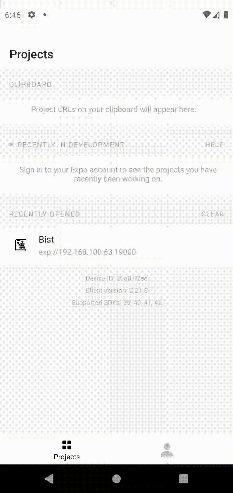

<h1 align="center">
	
</h1>
<p align="center">
  <a href="#open_book-about">About</a>&nbsp;&nbsp;&nbsp;|&nbsp;&nbsp;&nbsp;
  <a href="#-api">API</a>&nbsp;&nbsp;&nbsp;|&nbsp;&nbsp;&nbsp;
  <a href="#rocket-technologies">Technologies</a>&nbsp;&nbsp;&nbsp;|&nbsp;&nbsp;&nbsp;
  <a href="#information_source-how-to-use">How to use</a>&nbsp;&nbsp;&nbsp;|&nbsp;&nbsp;&nbsp;
  <a href="#memo-license">License</a>
</p>

<div align="center">
	
	
</div>


## :open_book: About
App to help peoples with your supermarket buy list 


## :rocket: Technologies
- [Expo](https://docs.expo.io)

- [Axios](https://github.com/axios/axios)

- [React Native Input Mask](https://github.com/react-native-text-input-mask/react-native-text-input-mask)

- [React Native SVG](https://github.com/react-native-svg/react-native-svg) + [React Native SVG Transformer](https://github.com/kristerkari/react-native-svg-transformer)

## 🔖 API

You can find the api [here](https://github.com/jvrapi/bist-api)

## :information_source: How to use

To clone and run this application, you'll need [Git](https://git-scm.com) and  [Node.js v14.16](https://nodejs.org) higher installed on your computer. This project utilized too [Yarn v1.22.5](https://yarnpkg.com). From your command line:

```bash
# Clone this repository
$ git clone https://github.com/jvrapi/bist.git

# Go into the repository
$ cd bist

# Install dependencies
$ yarn install ou npm install

# Start the project
$ expo start

```

## :memo: License
Esse projeto está sob a licença MIT. Veja o arquivo [LICENSE](./LICENSE) para mais detalhes.

---


<div align="center">


Feito com  ❤ por [João Vitor Santos](https://github.com/jvrapi) 👋 Entre em contato!

[](https://www.linkedin.com/in/joaovitorssdelima/) 
[](mailto:joaooviitoorr@gmail.com) 
[](mailto:joaooviitorr@hotmail.com)
	
</div>
